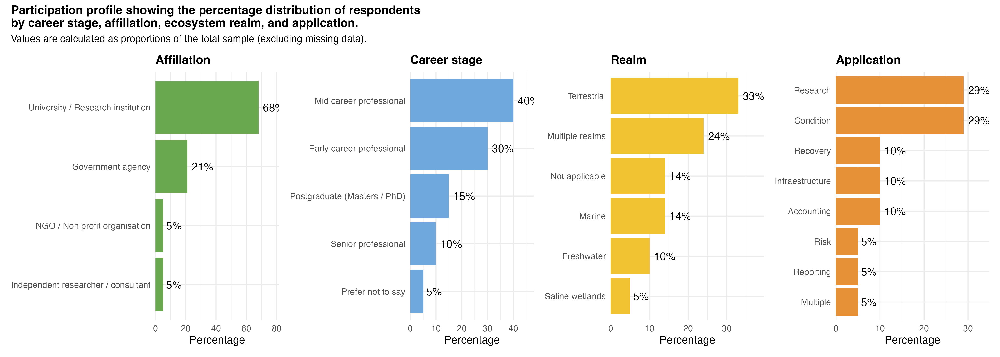

## 1. Participant profile

The workshop have a total of 26 participants. Participation was strongly dominated by academic contributors, with representatives from government agencies as the second most prevalent group. The participation was career-diverse but centered on early- to mid-career individuals, with a strong pipeline from postgraduate researchers. The sample was broad in ecosystem coverage, but terrestrial and cross-realm work dominated, while more specialised systems (like saline wetlands) were underrepresented.

Participation leans toward research-oriented thematic areas, but there was evidence of applied and policy-related applications such as ecosystem condition, recovery, and accounting, indicating a mixed but research-heavy community.

{fig-align="center"}

## 2. Familiarity

### **2.1 What we did**

Generate FAIR workflows for ecosystem indicators involves working with different data collections, programming languages, data formats, analytical tools, and platforms. We designed the "Familiarity" exercise to build a shared understanding of participants’ experience across theses components of the workflow and identify strengths, gaps, and challenges in working with data, tools, and platforms.

### 2.2 How we did it

Participants firts saw a 20 minutes presentation explaining the main concepts, and demonstrating how the workflow looks like from an end-user perspective. After the presentation, participants were assigned to a team (5 - 7 people) and to a specific aspect of the workflow (e.g., data collection, programming languages, data formats, platforms, or analytical tools). This was a two-part exercise:

1.  **Familiarity mapping**: Participants assessed their level of experience with different pre-defined items using a quick, intuitive placement exercise. For that, they placed each item within a given familiarity level (confort zone, learning zone, stretching my limits, and beyond my limits). If they know about items not provided in the board, they were encouraged to write it down in sticky notes.

2.  **Practice reflection**: Participants documented (in sticky notes) how do their current practices align with their skills, capabilities, and available IT support, how they address challenges, and what tips and recommendations you can share?

After completing their assigned board, participants were encouraged to move to a different board of their choice and do the steps 1 or 2.

### 2.3 How we analyzed the data

We then count how many times a given item was placed in a given familiarity level. In this context, “n” represents the number of responses (or mentions) for each item. In other words, how many participants reported their familiarity with that specific item. A higher *n* (e.g., QGIS with *n = 10*) means more participants contributed responses, so the distribution is more reliable and representative. A lower *n* (e.g., Markdown with *n = 5*) means the result is based on fewer responses and should be interpreted more cautiously.

When a given item shows strong familiarity (comfort zone) *and* has a high *n*, you can be confident that the item is widely used and well understood. When a item shows high familiarity but has a small *n*, it might represent a niche tool rather than a general preference.

### 2.4 Results-Analytical tools

Participants demonstrated strong familiarity with a small set of core tools, particularly RStudio, QGIS, and to a slightly lesser extent ArcGIS and Google Earth Engenering, where most responses fall within the comfort and learning zones. This indicates these tools are well established and can serve as the foundation of current workflows.

In contrast, tools such as Markdown, Quarto, and Jupyter notebooks occupy an intermediate position, with responses concentrated in the learning and stretching zones, suggesting they are known but not yet fully integrated into everyday use.

Finally, tools like Kepler and MapInfo exhibit very low familiarity, with most responses in the stretching or beyond limits zones, indicating limited adoption and potential barriers to use.

{fig-align="center" width="400"}

### 1.5 Results - Data collections

Participants appear to be familiar with a wide range of data sources, including climate (BOM), citizen science (eBird), marine data (AODN) and national research infrastructure (Research Data Australia, Find Environmental Data), where the majority of responses fall in the comfort zone, indicating strong familiarity and routine use.

Regional data collections such SEED (from NSW), The LIST (Tasmania), Enviro Data (South Australia) are concentrated in the stretching and beyond limits zones, indicating that many participants either have minimal exposure or find them difficult to use.

In contrast, sources such as CSIRO Data Explorer, TERN, and other national infrastructures show a dominance of the learning zone, suggesting awareness but limited practical experience.

{fig-align="center" width="400"}

Participants rely heavily on a core set of familiar data sources, while many specialised platforms remain underutilised. The most effective strategy is not to train on everything, but to prioritise key platforms, support gradual skill development where adoption is feasible, and simplify the overall data ecosystem where possible. For data collections with low familiarity (e.g., SEED, IMOS, The LIST), before investing heavily in training, it is important to assess whether these platforms are critical to organisational or regional goals or whether they duplicate functionality available in more familiar tool.

## Data formats

Participants are most familiar with traditional and widely used data formats, particularly Shapefiles, which show a strong concentration in the comfort zone, suggesting they are well established in everyday workflows.

Formats such as R data files (.rda), GeoPackage (GPKG), GeoTIFF, and standard data sheets show a predominance of responses in the learning zone, indicating that participants are generally aware of and use these formats but may not feel fully confident working with them in more advanced contexts.

In contrast, more specialised or modern formats, such as DataCube/DEA and cloud-optimised structures, are largely concentrated in the stretching and beyond limits zones, suggesting limited familiarity and potential barriers to adoption.

{fig-align="center" width="400"}

It is important to assess whether all advanced formats are necessary for all the workflows. Where possible, workflow development should prioritise a smaller set of well-supported formats to reduce complexity and improve efficiency, while introducing newer formats gradually through guided use cases. A balanced approach, combining capacity building, and clear guidance, will help improve adoption of newer, more scalable data formats without overwhelming users.

## Platforms

Participants’ familiarity with the initial set of platforms proposed was generally low and uneven, with only a few exceptions. Most platforms, such as CoDesign, Digital Earth Australia, Data Commons, GADI, and Argo/Xarray, were dominated by responses in the stretching and beyond limits zones, indicating that participants have limited experience and may perceive these platforms as complex or difficult to use.

A smaller group of platforms, such as Google Earth Engine, shows a stronger presence in the learning and comfort zones, suggesting moderate familiarity and some level of active use. Additionally, the “Other” category (ARDC Nectar Research Cloud, Research Data Australia) stands out with a strong concentration in the comfort zone, indicating that participants rely on a diverse set of alternative or external platforms with which they are already confident. This suggests that while specialised platforms exist, users often depend on tools outside the predefined list that better fit their workflows or are more accessible.

{fig-align="center" width="400"}

## Programming languages

Participants showed the strongest familiarity with R, which stands out as the only language dominated by responses in the comfort zone, indicating confident and regular use. This suggests that R is the primary programming language currently embedded in participants’ workflows.

In contrast, languages such as Python and Bash are concentrated mostly in the learning zone, indicating that participants are aware of them and may use them occasionally but do not yet feel fully confident. These languages appear to be in a transitional stage, with potential for further development.

Most other languages, including C/C++, JavaScript, Julia, and Zsh, are overwhelmingly concentrated in the beyond limits zone, with little to no representation in the comfort zone. This indicates very low familiarity and minimal practical use among participants, suggesting that these tools are either highly specialised or not aligned with current needs.

It is also worth noting that the number of responses (n) is relatively small for several languages (e.g., *n = 3–4* for Bash, Julia, Zsh), indicating that the results for these tools should be interpreted cautiously, as they may reflect niche use rather than broader trends.

{fig-align="center" width="400"}
